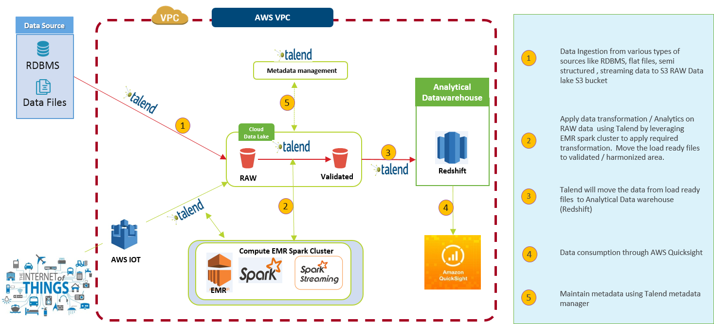
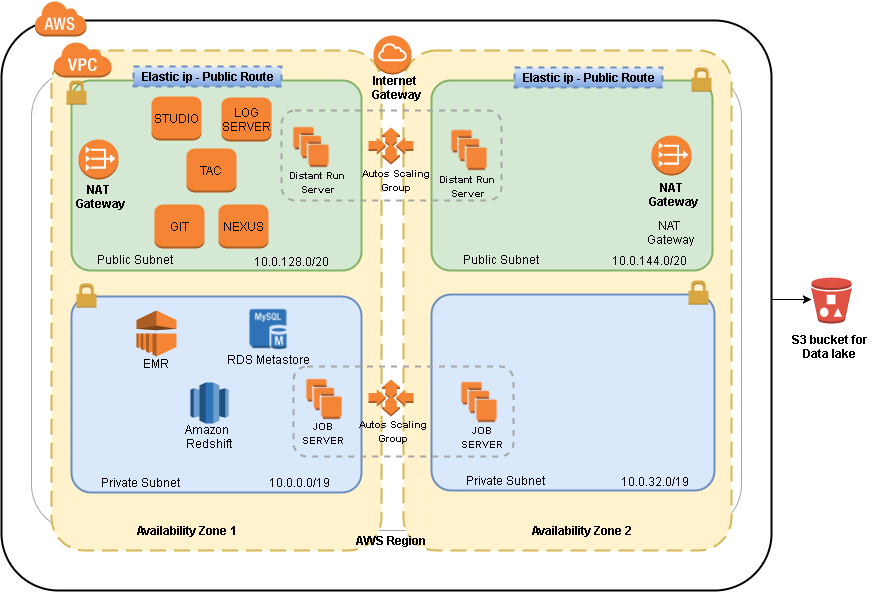
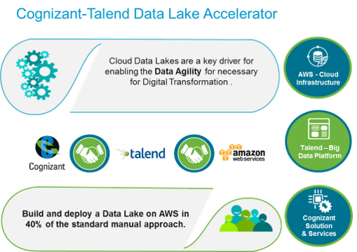

# Data Lake Quick Start from Cognizant and Talend

This Quickstart will get you launched on your big Data journey rapidly with a simple but highly relevant workflow focused on common Data Lake use cases.

1. Begin by **[registering for a Talend Platform for Big Data evaluation license](https://info.talend.com/trial-talend-quickstart-datalakes.html)**.  
2. Once you have registered you will receive your license attached in an email.
3. Load the license file into a private S3 bucket.
3. Follow the [Deployment Guide](https://s3.amazonaws.com/docs.quickstart.talend/Data+Lake+Quick+Start+from+Cognizant+and+Talend+-+Deployment+Guide.pdf) to launch Cloud Formation templates for automated deployment of your Talend infrastructure as well as AWS EMR and Redshift clusters.
4. Follow up with the step-by-step [User's Guide](https://s3.amazonaws.com/docs.quickstart.talend/Data+Lake+Quick+Start+from+Cognizant+and+Talend+-+User+Guide.pdf) to see the different Talend components in action.

You can **[deploy on AWS into a new VPC](https://console.aws.amazon.com/cloudformation/home?region=us-east-1#/stacks/new?templateURL=https://s3.amazonaws.com/oodle.app.talend/templates/oodle-master.template)** or **[deploy into an Existing VPC](https://console.aws.amazon.com/cloudformation/home?region=us-east-1#/stacks/new?templateURL=https://s3.amazonaws.com/oodle.app.talend/templates/oodle.template)**.

This quick start helps extend your AWS Data Lake foundation with Talend Platform for Big Data to achieve faster time to value.  Explore visual job design with sample Talend Jobs illustrating Cognizant best practices for integrating your data lake workflows.  Go deeper by leveraging Cognizant's expertise to get your Data Lake operational in AWS with Talend in less than two months.

Talend allows you to ingest and process your Data Lake workloads in a variety of ways depending on your requirements.  Use lightweight JVM's for ingest of data, use pushdown ELT style processing with Hive or Redshift to visually transform your data, or use use native Spark for more complex processing.

With Devops based on AWS Cloud Formation, you will have your Talend big data environment up and running in minutes.

**What you'll build**:

* A virtual private cloud (VPC) with multiple subhnets for hosting your Talend and AWS Infrastructure. *

* AWS EMR and Redshift Clusters.

* A Talend Administration Center (TAC) EC2 instance for managing, monitoring, and controlling your projects, users, and jobs.

* Talend Studio EC2 instance for designing your jobs.  It comes with pre-installed sample jobs and is accessible via remote X-windows desktop.  Or run Talend Studio on your own laptop.

* Jobservers for running your jobs.

* A Nexus server for storing and version controlling your job binaries.

* A Git server for versioning your job designs.

* A Logserver for monitoring your jobs.

* Your choice to create a new VPC or deploy into your existing VPC on AWS. The template that deploys the Quick Start into an existing VPC skips the components marked by asterisks above.

* See the [Deployment Guide](https://s3.amazonaws.com/docs.quickstart.talend/Data+Lake+Quick+Start+from+Cognizant+and+Talend+-+Deployment+Guide.pdf) for more detials.

* See the [User's Guide](https://s3.amazonaws.com/docs.quickstart.talend/Data+Lake+Quick+Start+from+Cognizant+and+Talend+-+User+Guide.pdf) for a tour of the sample jobs.

Data is your companies core asset.  Digital transformation requires a sustainable, long term perspective on achieving continuous innovation through data agility.  You need an extended team with complementary skills to get your Data Lake initiative up and running quickly so that you can focus on your data rather than the technology.  The Talend Data Lake Accelerator (TDLA) Quickstart is just the first step.  Work with Cognizant and Talend to tailor a custom soluton offering for your AWS Data Lake.

