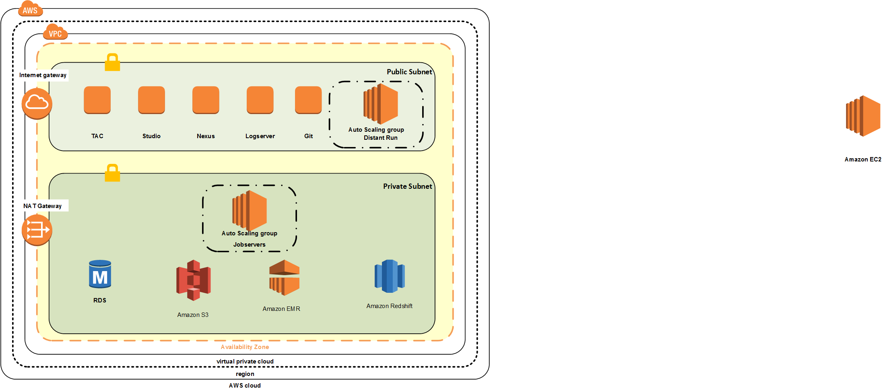

This quick start helps extend your AWS Data Lake foundation with Talend Platform for Big Data to achieve faster time to value.  Explore visual job design with sample Talend Jobs illustrating Cognizant best practices for integrating your data lake workflows.  Follow-up by leveraging Cognizant expertise to get your Data Lake operational in AWS with Talend in less than two months.

1. Begin my registering to receive a Talend Platform for Big Data evaluation license on our landing page **(url to be provided)**.  
2. Once you have registered you will receive your license attached in an email.  Load the license file into an S3 bucket.
3. Follow the [Deployment Guide](https://s3.amazonaws.com/docs.quickstart.talend/Out+of+the+Box+Datalake+-+Deployment+Guide.pdf) to launch Cloud Formation templates for automated deployment of your Talend infrastructure as well as AWS EMR and Redshift clusters.
4. Follow up with the step-by-step [User's Guide](https://s3.amazonaws.com/docs.quickstart.talend/Out+of+the+Box+Data+Lake+-+User+Guide.pdf) to see the different Talend components in action.

Talend allow you to ingest and process your Data Lake workloads in a variety of ways depending on your requirements.  Use lightweight JVM's for ingest of data, use pushdown ELT style processing with Hive or Redshift to visually transform your data, or use the full power of Spark for more complex processing.

What you'll build:

* A virtual private cloud (VPC) with multiple subhnets for hosting your Talend and AWS Infrastructure. *

* AWS EMR and Redshift Clusters.

* A Talend Administration Center (TAC) EC2 instance for managing, monitoring, and controlling your projects, users, and jobs.

* Talend Studio EC2 instance for designing your jobs.  It comes with pre-installed sample jobs and is accessible via remote X-windows desktop.  Or run Talend Studio on your own laptop.

* Jobservers for running your jobs.

* A Nexus server for storing and version controlling your job binaries.

* A Git server for versioning your job designs.

* A Logserver for monitoring your jobs.

* Your choice to create a new VPC or deploy into your existing VPC on AWS. The template that deploys the Quick Start into an existing VPC skips the components marked by asterisks above.

* See the [Deployment Guide](https://s3.amazonaws.com/docs.quickstart.talend/Out+of+the+Box+Datalake+-+Deployment+Guide.pdf) for more detials.

* See the [User's Guide](https://s3.amazonaws.com/docs.quickstart.talend/Out+of+the+Box+Data+Lake+-+User+Guide.pdf) for a tour of the sample jobs.